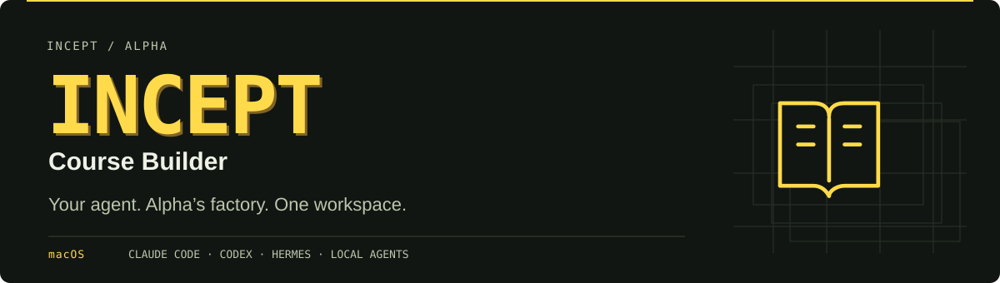
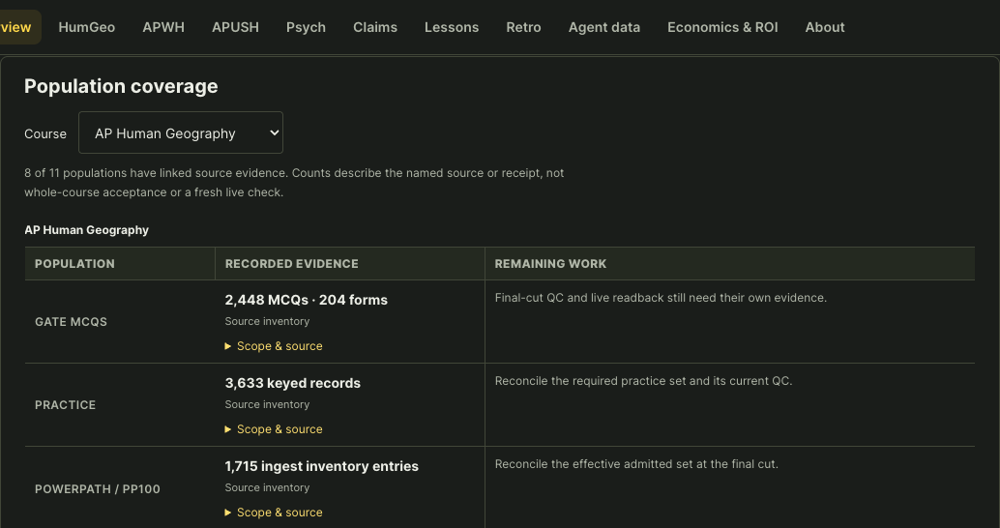

<p align="center">
  
</p>

<h1 align="center">Incept Course Builder</h1>

<p align="center">Build courses with your agent, using Alpha’s native factory.</p>

<p align="center">
  <a href="#quick-start"><strong>Install</strong></a> ·
  <a href="docs/getting-started.md">Setup guide</a> ·
  <a href="https://github.com/InceptTrilogy/ap-four-course-dashboard/blob/main/course-runbook/START.md">Agent runbook</a> ·
  <a href="https://joshuadurey-del.github.io/incept-course-builder/courses.html">Courses</a> ·
  <a href="https://joshuadurey-del.github.io/incept-course-builder/about.html">About</a>
</p>

<p align="center"><sub>macOS · Terminal onboarding · Local workspace · Alpha / Incept team access</sub></p>

## Quick start

Paste into Terminal:

```bash
curl -fsSL https://joshuadurey-del.github.io/incept-course-builder/install.sh | bash
```

**Sign in → Describe your course → Choose your agent → Watch progress in your customized dashboard.**

Use a GitHub account with a verified **@alpha.school** email and access to the [private package](https://github.com/InceptTrilogy/ap-four-course-dashboard). Setup checks your machine, reuses existing tools, and installs missing runtime components. [Access or setup help →](docs/getting-started.md)

```bash
~/.local/bin/incept-course-builder build
```

Works with **Claude Code, Codex, Hermes**, and tool-capable local agents. You keep your existing model access.

Start from a course brief or resume existing work. Your agent develops the blueprint, generates and checks content through Content Factory, then assembles it for native publication and learner verification. Your local dashboard updates as the agent saves progress and stays available after Terminal closes. Reopen it at the same local address; run `incept-course-builder build` to resume the agent. [From-zero workflow and current execution requirements →](docs/getting-started.md#from-zero-to-a-complete-course)

The agent handles setup and execution choices. When it needs something only you can provide, it gives you a plain request, a prepared action, and access-recovery steps. Credentials are entered privately in Terminal or through native sign-in.

## Your course, in one customized dashboard

<p align="center">
  
  <br><sub>Public progress view, captured September 10, 2026. Open a course for population coverage and source evidence. Your installed workspace runs locally.</sub>
</p>

| What you get | What it helps you do |
| :--- | :--- |
| **Terminal setup** | Configure the course and agent without assembling the toolchain by hand. |
| **Bundled factory skills** | Give your agent native tools, workflow instructions, scripts and references. |
| **Whole-course discovery** | Find missing populations before accepting a plan’s progress claims. |
| **An executable runbook** | Plan independent work in parallel; keep integration and publication in order. |
| **A persistent local dashboard** | Watch saved progress update automatically, even after the agent session ends. |

## From brief to verified course

| Align | Synthesize | Assemble | Prove |
| :--- | :--- | :--- | :--- |
| Create the blueprint, or reconcile existing sources and coverage. | Author, repair and judge missing content. | Integrate accepted work into the course. | Run native publication and learner checks. |

The runbook guides your agent through these stages using each course’s native tooling. Current permissions, budgets and release gates govern execution. Course completion requires verified learner-facing results.

[Explore the runbook →](https://github.com/InceptTrilogy/ap-four-course-dashboard/blob/main/course-runbook/START.md) · [See reusable value & ROI →](https://joshuadurey-del.github.io/incept-course-builder/economics.html)

## Find your next step

| I want to… | Open |
| :--- | :--- |
| Install, update, switch agents or troubleshoot sign-in | [Setup & everyday use](docs/getting-started.md) |
| Give an agent the smallest useful starting context | [Agent entry point](https://github.com/InceptTrilogy/ap-four-course-dashboard/blob/main/course-runbook/START.md) |
| Understand the product and access model | [About Incept](https://joshuadurey-del.github.io/incept-course-builder/about.html) |
| Check published course progress | [Course workspace](https://joshuadurey-del.github.io/incept-course-builder/courses.html) |
| Inspect evidence or improve the next build | [Claims](https://joshuadurey-del.github.io/incept-course-builder/claims.html) · [Lessons](https://joshuadurey-del.github.io/incept-course-builder/lessons.html) |

<details>
<summary><strong>For maintainers: source map and local checks</strong></summary>

| Path | Purpose |
| :--- | :--- |
| [Builder application](https://github.com/InceptTrilogy/ap-four-course-dashboard) | Application code, persistent dashboard service, installer and agent runbook (team access) |
| [install.sh](install.sh) | Public bootstrap for the private builder |
| [index.html](index.html) · [courses.html](courses.html) · [docs.html](docs.html) · [style.css](style.css) | Dashboard pages and shared theme |
| [data.json](data.json) · [process.json](process.json) | Published observations and process navigation |
| [updates.json](updates.json) · [automation/](automation/) | Activity feed and its existing publisher |
| [docs/](docs/) | Product setup guide and README assets |

```bash
node --check timeline.js
node timeline.js
node updates.js
node test_asap_ui.cjs
```

With Playwright available, `node test_asap_ui.cjs --browser` checks navigation, keyboard controls, mobile layouts and unavailable inputs using synthetic data.

</details>

---

<sub>This is the public dashboard and install entry point. The builder package and agent runbook require Alpha / Incept team access; course content and local checkpoints are not included here.</sub>
